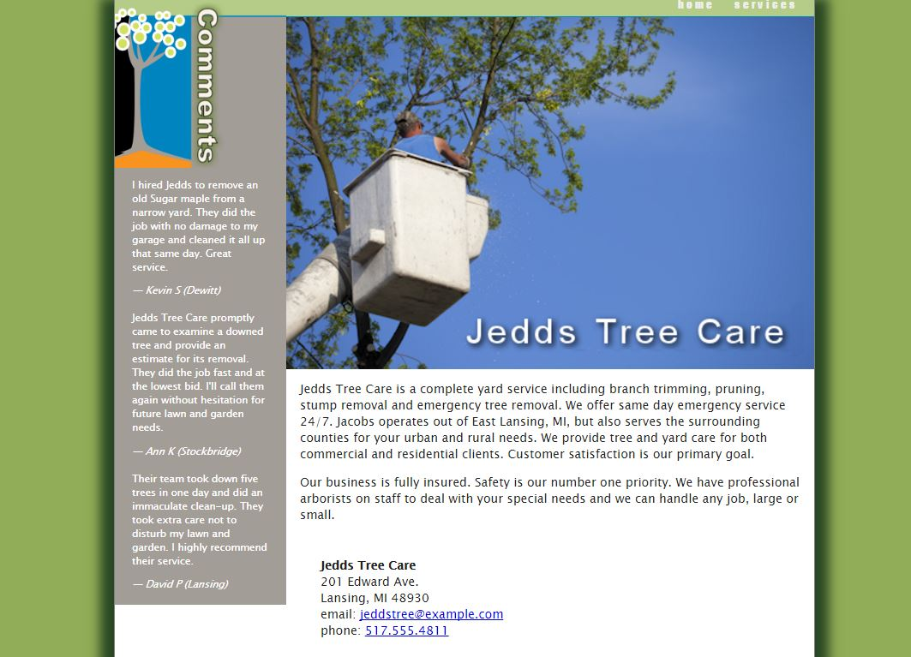
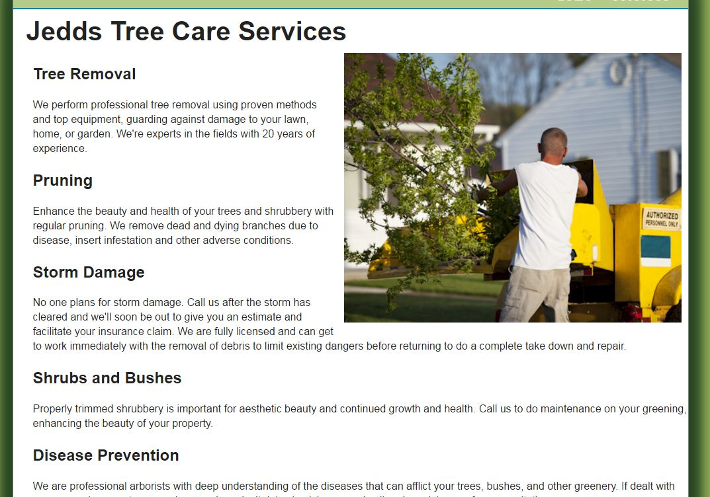

# JeddsTreeCare

3.1 Create a Jedds Tree Care Assessment  all documentation is attached at the bottom of this page.
Instructions

Open up Jedds Tree Care that you created.

Create three pages, Careers page, client-promise page, and a page on the Emerald Ash bore - you will have to find your own pictures and information about this tree killing insect.

format them using CSS 

At the bottom of every page you must place into the footer three images using font awesome. Twitter, Facebook, and Instagram.

# Jedds Tree Care Part 2

Instructions

Open up Jedds Tree Care that you created.

Create three pages, Careers page, client-promise page, and a page on the Emerald Ash bore - you will have to find your own pictures and information about this tree killing insect.

format them using CSS 

At the bottom of every page you must place into the footer three font awesome icons(Google Font Awesome to learn). Twitter, Facebook, and Instagram. Each image must link to the coresponding images site page. Use the Font Awesome to complete this part.

All Pages must be linked to one another. 

